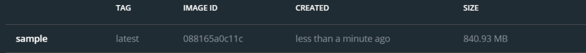
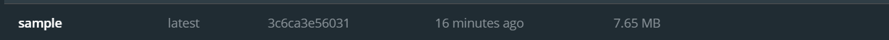

# Multi Stage Docker Builds featuring Golang

Find out <a href="https://learnai1.home.blog/2021/01/18/multi-stage-docker-builds-ft-golang/">our blog</a> on <a href="https://learnai1.home.blog/">Hello World</a>, which helps you learn build multi stage docker images.

## Size Comparison

## Single Stage - 840 MB

## Multi Stage - 8MB

